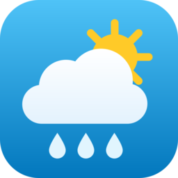

# Vremenska postaja Žiri

A [Home Assistant](https://www.home-assistant.io) custom integration that reads
current weather and air quality from the amateur weather station in Žiri,
Slovenia ([vreme-ziri.si](https://www.vreme-ziri.si/)).

## Features

- Polls the station every 5 minutes
- Temperature, humidity, wind speed/gust/direction, rain rate and daily total,
  pressure, UV index, solar radiation, evapotranspiration and sunshine duration
- PM1, PM2.5, PM10 and AQI (current and last hour) from the station's dust sensor
- **River Sora** water level, flow and temperature — useful for flood alerts
- **Snow depth** and fresh snow from the daily 7:00 manual measurement
- **Today's extremes** — max/min temperature, humidity and pressure, strongest
  gust, heaviest rain, max UV, each with the time it happened, plus the current
  dry and rainy spell in days
- Wind direction as a compass point (S, SSV, … in Slovenian notation)
- **Stale data** problem sensor that turns on when the 5-minute table stops updating
- Each page is fetched and fails on its own, so e.g. a broken dust-sensor sheet
  never takes the weather sensors down with it
- **Header fallback.** When the 5-minute data table is empty or can't be read
  (this happens around the start of each month), temperature, humidity, wind
  speed and rainfall are taken from the "Trenutno na meteorološki postaji ŽIRI"
  line in the page header instead of failing with
  *"No data rows found in table"*. Sensors the header does not cover show
  *unknown* until the table is back.
  The diagnostic sensor **Vir podatkov** shows which source is in use, so
  you can see it on a dashboard or use it in automations.
- Single device with all sensors, set up from the UI

## Installation (HACS)

1. In Home Assistant open **HACS**, click the menu (⋮) → **Custom repositories**.
2. Add this URL with type **Integration**:
   ```
   https://github.com/golaz777/HAVremenskaPostajaZiri
   ```
3. Search for **Vremenska postaja Žiri** in HACS and click **Download**.
4. Restart Home Assistant.
5. Go to **Settings → Devices & services → Add integration** and pick
   **Vremenska postaja Žiri**.

### Moving from a manual install

If you previously copied the files into `config/custom_components/vremenska_postaja_ziri`
by hand, just do the HACS steps above. HACS writes to the same folder and the
integration domain is unchanged, so your existing entry, entities and history
stay as they are. Skip step 5.

## Updating

HACS checks for new versions periodically. When one is released it shows up
under **Settings → Updates** (and in HACS). Click **Update**, then restart Home
Assistant.

To check right away: **HACS → ⋮ on the integration → Update information**.

## Sensors

| Sensor | Unit | Header fallback |
|---|---|---|
| Temperatura | °C | ✅ |
| Vlažnost | % | ✅ |
| Hitrost vetra | km/h | ✅ |
| Vsota padavin | mm | ✅ |
| Sunek vetra | km/h | |
| Smer vetra (°) | ° | |
| Prevladujoča smer vetra | text | |
| Jakost padavin | mm/h | |
| Zračni tlak | mbar | |
| UV indeks | | |
| Sončno obsevanje | W/m² | |
| ET izhlapevanje | mm | |
| Trajanje sončnega obsevanja | h | |
| Smer vetra | S, SSV, SV, … | |
| Datum, Čas meritve | text | |
| PM1, PM2.5, PM10 | µg/m³ | n/a (separate source) |
| AIQ-trenutni, AQI-v zadnji uri | | n/a (separate source) |
| Vir podatkov (diagnostic) | Tabela / Glava strani | shows which source is in use |
| Zastareli podatki (diagnostic, binary) | on / off | unknown while on header fallback |

### Today's extremes (`today.php`, every 15 min)

Each has a `time` attribute with when it happened (HH:MM).

| Sensor | Unit |
|---|---|
| Najvišja / Najnižja temperatura danes | °C |
| Najvišja / Najnižja vlažnost danes | % |
| Najmočnejši sunek danes, Najvišja hitrost vetra danes | km/h |
| Največja jakost padavin danes | mm/h |
| Največ padavin v eni uri danes | mm |
| Najvišji / Najnižji zračni tlak danes | mbar |
| Najvišji UV indeks danes | |
| Trenutno sušno / deževno obdobje | days |

### River Sora (`vodostaj.php`, every 15 min)

| Sensor | Unit | Attributes |
|---|---|---|
| Vodostaj Sore | cm | `measured_at` |
| Pretok Sore | m³/s | `measured_at`, `description` (e.g. *mali pretok*) |
| Temperatura Sore | °C | `measured_at` |

The site publishes river data roughly hourly, so `measured_at` can trail the
current time by an hour or more.

### Snow (`snezna_kamera_ziri.php`, hourly)

| Sensor | Unit | Attributes |
|---|---|---|
| Višina snega | cm | `measured` (date), `notes` |
| Novozapadli sneg | cm / 24 h | `measured` (date), `notes` |

Snow is measured by hand at 7:00. If the latest measurement is more than 3
days old (all summer, for example) the sensors show *unknown* instead of last
season's value; the `measured` attribute still shows when it was taken.

### Example: flood alert

```yaml
automation:
  - alias: Sora flood warning
    triggers:
      - trigger: numeric_state
        entity_id: sensor.vremenska_postaja_ziri_vodostaj_sore
        above: 200
    actions:
      - action: notify.notify
        data:
          message: "Sora is at {{ states('sensor.vremenska_postaja_ziri_vodostaj_sore') }} cm"
```

Entity IDs depend on your setup; check yours under **Settings → Entities**.

## Development

```bash
pip install pytest-homeassistant-custom-component
python -m pytest
```

The HTML parsing lives in `scraper.py`, which has no Home Assistant imports, and
is tested against real page captures in `tests/fixtures/`. `tests/test_init.py`
sets the integration up in a test Home Assistant instance with mocked pages.

## AI Disclaimer

Parts of this project were developed with assistance from AI tools (Claude by
Anthropic). All code has been reviewed and tested by the author. Use at your
own risk.

## License

MIT
